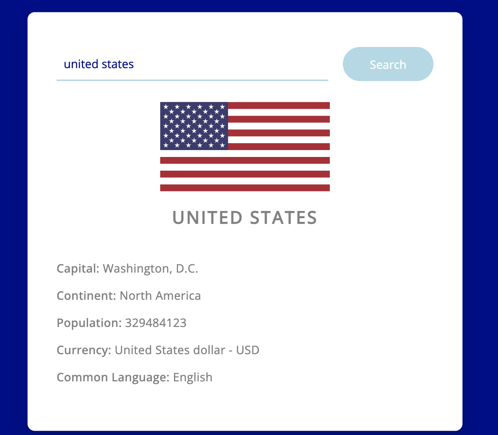
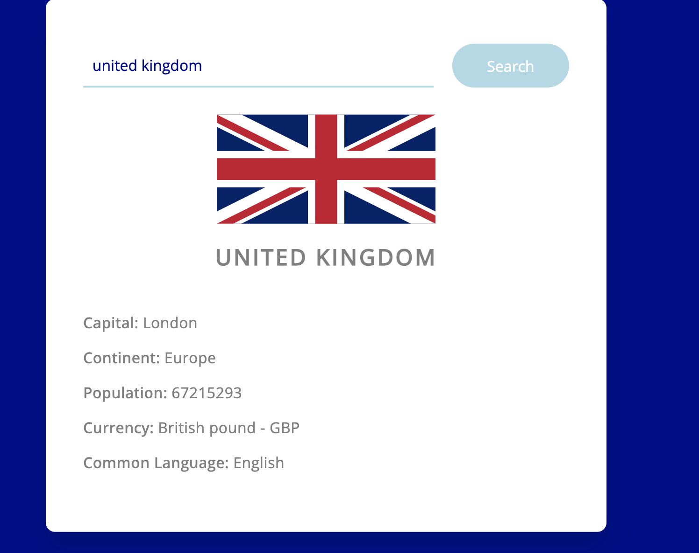
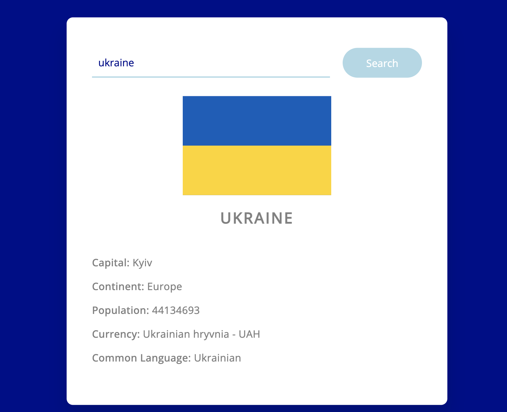

# Country Lookup
## Description
Lightweight app used to lookup a country giving details about inputed country.

## Table of Contents
- [Wireframe](#wireframe)
- [Instructions](#instructions)
- [Usage](#usage)
- [User Story](#user-story)
- [Future Directions](#future-directions)
- [Credits](#credits)
- [License](#license)

## Wireframe
Screenshots of working project.

United States:<br>


United Kingdom:<br>


Ukraine:<br>



## Instructions
To search for a counrty enter the full name of counrty and click the search button, your country will pop up. Repeat to search for another country.


## Usage
## 👉 [This application is live!](https://bballplayer33.github.io/country-lookup/)

## User Story

```
As a User I would like to quickly look up a nation with a breif discription.

```
## Future Directions


## Credits
A thanks to our resources:
- [OpenLibrary API](https://openlibrary.org/dev/docs/api/books)
- [Visual Studio Code](https://code.visualstudio.com/download)

## License

